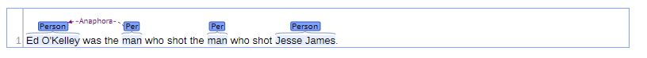
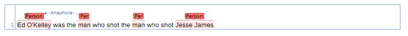
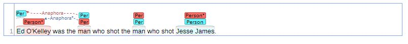

# Brave

Built on top of [BRAT](http://brat.nlplab.org/), Brave is a high-level library which allows simple and beautiful NLP data visualisation. Brave supports full integration with Jupyter notebooks.

<p align="center">
    
</a></p>

Brave is a project led by [Chorus.ai](https://www.chorus.ai/) Research Team. 

## Table of contents

* [Quick start options](#quick-start-options)
* [Usage](#usages)
* [Creators](#creators)
* [Notes](#notes)


## Quick start options


#### Clone the repo

```bash
git clone https://github.com/chorusai/brave.git
```

#### Install with setup.py

```bash
python setup.py install
```


## Usage

### Initialisation

Applications should initialise Brave using:

```python 
from brave import brave
```

For visualising data in Jupyter notebooks:

```python
from brave import brave, start_notebook_mode
start_notebook_mode()
```

### Example: brave()

Brave requires two Python objects as inputs.

First argument is the document, with the following data structure:


```python
doc_data = {
    "text": "Ed O'Kelley was the man who shot the man who shot Jesse James.",
    "entities": [
        [
            "T1",
            "Person",
            [ ( 0, 11 ) ]
        ],
        [
            "T2",
            "Person",
            [ ( 20, 23 ) ] 
        ],
        [
            "T3",
            "Person",
            [ ( 37, 40 ) ] 
        ],
        [
            "T4",
            "Person",
            [ ( 50, 61 ) ] 
        ]
    ],
    "relations": [
        [
            "R1",
            "Anaphora",
            [ [ "Anaphor", "T2" ], [ "Entity", "T1" ] ]
        ]
    ]
}
```

Second (can be optional) argument is the collection, which has the following data structure:


```python
coll_data = {
      "entity_types": [
        {
            "type": "Person",
            "labels": [ "Person", "Per" ],
            "bgColor": "#7fa2ff",
            "borderColor": "darken"
        }
    ],
    "relation_types": [
        {
            "type": "Anaphora",
            "labels": [ "Anaphora", "Ana" ],
            "dashArray": "3,3",
            "color": "purple",
            "args": [
                {
                    "role": "Anaphor",
                    "targets": [ "Person" ]
                },
                {
                    "role": "Entity",
                    "targets": [ "Person" ]
                }
            ]
        }
    ]
}
```


Both structures can be imported calling :


```python
from examples.brave_example import coll_data, doc_data
```


Then call **brave()** function to load the HTML within the notebook:


```python
brave(doc_data, coll_data)
```


<p align="center">
    
</a></p>


### Example: brave_simple()


The document object can be called without the collection. Using the **brave_simple()** function automatically generates relations and entities:

```python
from brave import brave_simple
brave_simple(doc_data)
```

<p align="center">
    
</a></p>

### Example:  brave_compare()


The **brave_compare()** function lets you compare true extractions and predicted extractions.

```python
from brave import brave_compare
brave_compare(doc_data, pred_doc_data)
```

<p align="center">
    
</a></p>


## Creators

* Ilana Tuil
* Karen Assaraf
* Orgad Keller
* Raphael Cohen
* Amit Ashkenazi
* Romain Ammar

## Notes

MIT Licensed files (brat) are automatically downloaded as part of the normal operation of this library.


